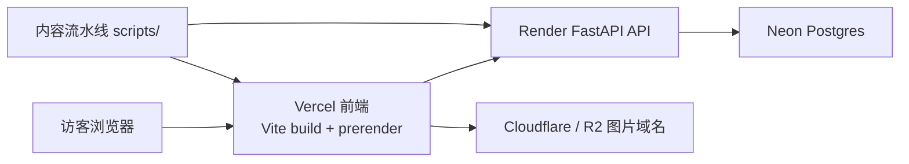

# AI 资讯观察 / ai.blog

一个面向公开访客的中文 AI 资讯与专题博客仓库，采用前后端分离与自动化内容流水线：

- `frontend/`: Vite + React 公共站点与后台管理界面
- `backend/`: FastAPI + SQLAlchemy API、订阅、缓存与图片服务
- `scripts/`: 自动抓取、整理、生成和发布内容的 Node.js 工具链

当前默认的线上分层是：

- `Vercel` 承载前端静态资源与公开页面预渲染结果
- `Render` 承载 FastAPI 后端
- `Neon Postgres` 承载生产数据库
- `Cloudflare R2 + Cloudflare` 承载图片与 CDN 分发

## 项目目标

这个项目不是单纯的“博客模板”，而是一个偏内容系统化运营的 AI 资讯站：

- 面向陌生访客的公开内容页优先可见，不等整页 JS 才出内容
- 支持文章、主题、系列、日报、周报、归档等公共内容入口
- 支持后台管理、发布、上传、站点设置和订阅能力
- 支持自动化内容流水线，把采集、整理、封面生成和发布串起来

## 目录结构

```text
.
├─ backend/                FastAPI 后端、数据库模型、公开/管理接口、订阅服务
├─ frontend/               Vite React 前端、公开页面、管理后台、预渲染脚本
├─ scripts/                自动化内容抓取、生成、发布、回填工具
├─ docs/                   本地启动、Neon/R2 配置、仓库维护说明
├─ render.yaml             Render 后端部署配置
└─ README.md
```

## 架构概览



说明：

- 公开页面由 `frontend/scripts/prerender-public.mjs` 在构建阶段生成可见 HTML。
- 后端提供公开读接口、管理接口、RSS、sitemap、图片代理与上传能力。
- 发布脚本可在发布完成后触发前端刷新。

## 主要能力

- 公开内容页：首页、文章详情、主题页、系列页、日报、周报、归档
- 公开数据接口：`/api/public/home-bootstrap`、文章列表、主题、系列、discover、feeds
- 管理后台：登录、文章管理、主题管理、系列管理、图片与设置管理
- 订阅能力：邮件 / Web Push / 企业微信 webhook
- 媒体链路：优先直连 R2/CDN，一方图片不再默认走后端代理
- 自动化内容：抓取 RSS / 来源、整理研究材料、生成封面、执行发布

## 技术栈

### Frontend

- React 18
- React Router
- Vite 5
- Tailwind CSS
- Vitest + Testing Library

### Backend

- FastAPI
- SQLAlchemy 2
- Pydantic 2
- Psycopg / Postgres
- Boto3（R2）
- PyWebPush

### Scripts

- Node.js ESM
- `node --test`
- 自定义内容抓取、质量门禁、封面生成与发布脚本

## 本地开发

推荐使用外部 `pwsh 7` 或 Git Bash 进行本地验证；Windows 集成 shell 在这个仓库里偶尔会出现不稳定行为。

### 1. 启动后端

```powershell
uv sync --project backend --extra dev
uv run --project backend -- uvicorn app.main:app --app-dir backend --reload
```

默认本地地址：

- API: `http://127.0.0.1:8000`
- 健康检查: `http://127.0.0.1:8000/api/health`

### 2. 启动前端

```powershell
cd frontend
npm install
npm run dev
```

默认本地地址：

- Site: `http://127.0.0.1:5173`

### 3. 运行内容脚本

```powershell
cd scripts
npm install
node auto-blog.mjs --mode daily-manual --dry-run --max-posts 1
```

## 环境变量

推荐复制以下示例文件：

- `backend/.env.example` -> `backend/.env`
- `frontend/.env.example` -> `frontend/.env`
- `scripts/.env.example` -> `scripts/.env`

### Backend 关键变量

用于 Render 或本地后端运行时：

- `APP_ENV`
- `DATABASE_URL`
- `SECRET_KEY`
- `ADMIN_USERNAME`
- `ADMIN_PASSWORD`
- `PUBLIC_SITE_URL`
- `ALLOWED_ORIGINS`
- `AUTO_SEED_ON_EMPTY`
- `R2_*`
- `RESEND_API_KEY`
- `EMAIL_FROM`
- `WEB_PUSH_VAPID_PUBLIC_KEY`
- `WEB_PUSH_VAPID_PRIVATE_KEY`
- `WEB_PUSH_SUBJECT`
- `WECOM_WEBHOOK_URLS`

### Frontend 关键变量

用于 Vercel 或本地前端构建：

- `VITE_API_BASE`
- `PUBLIC_SITE_URL`
- `VITE_IMAGE_PROXY_BASE`
- `VITE_IMAGE_DIRECT_BASES`
- `VITE_ALLOW_CROSS_ORIGIN_API`（仅在明确需要跨域时启用）

### Scripts 关键变量

用于自动化内容流水线：

- `BLOG_API_BASE`
- `ADMIN_USERNAME`
- `ADMIN_PASSWORD`
- `SILICONFLOW_API_KEY`
- `SILICONFLOW_BASE_URL`
- `SILICONFLOW_MODEL`
- `XAI_API_KEY`
- `VERCEL_DEPLOY_HOOK_URL`

### 密钥管理约定

生产运行时密钥应保存在部署平台，而不是依赖 GitHub Secrets 充当运行时真源：

- `Vercel`：前端构建与公开配置
- `Render`：后端私密运行时变量
- `GitHub Secrets`：只保留 CI/CD 或仓库自动化用途

## 部署说明

### Frontend / Vercel

前端构建命令定义在 `frontend/package.json`：

```bash
npm run build
```

其中包含两步：

1. `vite build`
2. `node ./scripts/prerender-public.mjs`

预渲染脚本会生成首页、文章、主题、系列、归档等公开页面的 HTML。为避免滚动发布时前后端接口契约不一致，首页 bootstrap 已兼容从新接口回退到旧接口组合。

### Backend / Render

`render.yaml` 已定义后端服务部署方式：

- Runtime: Docker
- Port: `8000`
- Health check: `/health`

生产环境建议：

- 使用 `Neon Postgres`
- 关闭 `AUTO_SEED_ON_EMPTY`
- 明确设置 `PUBLIC_SITE_URL`
- 明确设置 `ALLOWED_ORIGINS`
- 在 R2 已就绪时配置 `R2_PUBLIC_BASE_URL`

### 数据与媒体

- 数据库：优先 `Neon Postgres`
- 图片：优先 `Cloudflare R2` + 自定义图片域名
- 一方图片前端通过 `VITE_IMAGE_DIRECT_BASES` 直连
- `/proxy-image` 仅保留给第三方远程图片

## 常用命令

### Backend tests

```powershell
uv run --project backend pytest backend/tests
```

### Frontend tests

```powershell
cd frontend
npm test
```

### Scripts tests

```powershell
cd scripts
npm test
```

### 本地 smoke baseline

```powershell
uv sync --project backend --extra dev
uv run --project backend pytest backend/tests/test_settings_stats.py backend/tests/test_posts_list.py
cd frontend
npm install
npm run build
cd ..
cd scripts
npm install
node auto-blog.mjs --mode daily-manual --dry-run --max-posts 1
```

## 内容流水线

`scripts/` 目录负责自动化内容生产，常见职责包括：

- 抓取博客/RSS/论文等来源
- 去重、质量评估、整理研究素材
- 生成文章结构与封面提示词
- 调用后台发布接口
- 在发布后触发前端刷新

常见文件：

- `scripts/auto-blog.mjs`
- `scripts/publish-article.mjs`
- `scripts/publish-content-file.mjs`
- `scripts/generate-cover-for-post.mjs`
- `scripts/backfill-topic-profiles.mjs`
- `scripts/backfill-series-covers.mjs`

## 常见排障

### Vercel 构建失败

优先检查：

- `VITE_API_BASE` 是否指向可访问的后端
- `PUBLIC_SITE_URL` 是否与线上规范域名一致
- 后端是否已经部署了预渲染需要的公开接口

### 首访很慢

优先检查：

- 首页是否已经命中预渲染 HTML
- Render 后端是否处于冷启动状态
- 一方图片是否走了 `VITE_IMAGE_DIRECT_BASES` 直连
- 匿名公开接口是否返回缓存头

### 图片不显示

优先检查：

- `R2_PUBLIC_BASE_URL`
- `VITE_IMAGE_DIRECT_BASES`
- 第三方图片是否仍需走 `/proxy-image`

## 相关文档

- `docs/local-bootstrap.md`
- `docs/neon-r2-setup.md`
- `docs/repo-maintenance.md`
- `docs/codex-mcp-api-key-checklist.md`

## 许可

当前仓库未单独声明开源许可证；如需公开分发，请先补充 LICENSE。
