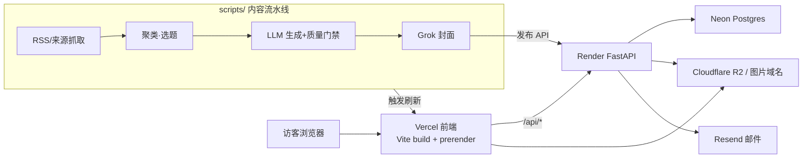

# AI 资讯观察 / ai.blog

面向公开访客的**中文 AI 资讯与专题博客**，采用前后端分离 + 自动化内容流水线的架构。它不是一个通用博客模板，而是一个偏「内容系统化运营」的资讯站：内容由自动化流水线采集、清洗、生成、配图并发布，公开页面在构建期预渲染以保证首屏可见与 SEO，访客可注册账号参与评论、点赞与个性化关注。

- **线上地址**：`https://www.563118077.xyz`（canonical host）
- `PUBLIC_SITE_URL`、SEO canonical、RSS、sitemap、前端路由输出都必须与该域名保持一致。

---

## 1. 系统组成

仓库是一个 monorepo，分三个相互独立、各自带依赖清单与测试运行器的包：

| 目录 | 职责 | 技术栈 | 部署目标 |
|------|------|--------|----------|
| `frontend/` | 公开站点 + 管理后台 + 构建期预渲染 | React 18 · Vite 5 · React Router 6 · Tailwind | Vercel（静态资源 + 预渲染 HTML） |
| `backend/` | 公开/管理 API、认证、订阅、存储、通知 | FastAPI · SQLAlchemy 2 · Pydantic 2 · Python 3.11 | Render（Docker） |
| `scripts/` | 自动化内容流水线与运维脚本 | Node.js ESM | CI / 本地按需运行 |

**生产基础设施**：Neon Postgres（数据库）· Cloudflare R2 + CDN（图片存储与分发）· Resend（邮件）· SiliconFlow / xAI Grok（LLM 文字与生图）。



---

## 2. 后端架构（`backend/app/`）

入口 `app/main.py`，启动时经 `bootstrap.initialize_runtime()` 完成 schema 同步与按需播种。

### 数据模型（`models.py`，24 张表）

- **内容核心**：`posts` / `series` / `tags`（M2M）/ `comments` / `post_sources`
- **站点与 AI 配置**：`site_settings` / `ai_channel_configs`（旧）/ `ai_provider_sources` + `ai_model_instances`（新，服务源→模型实例两层）/ `admin_image_generation_jobs`
- **发布与质量**：`publishing_runs` / `publishing_artifacts` / `post_quality_snapshots` / `post_quality_reviews` / `topic_profiles` / `search_insights`
- **互动与订阅**：`post_likes` / `view_logs` / `email_subscriptions` / `web_push_subscriptions` / `post_notification_dispatches`
- **访客用户系统**：`users` / `followed_topics` / `reading_history`（`comments`、`post_likes` 带可空 `user_id`）

> **schema 演进无 Alembic**：所有表/列变更通过 `app/schema_compat.py` 在启动期补齐（建表 + `ALTER ADD COLUMN`，幂等）。新增模型字段必须同步进该文件，详见 [§7 部署](#7-部署)。

### API 路由（`app/routers/` + `main.py` 直接端点）

| 路由模块 | 前缀 | 说明 |
|----------|------|------|
| `posts` | `/api` | 公开读：文章/系列/主题/搜索/归档/标签/评论/点赞/RSS |
| `home` | `/api/home` | 首页模块数据 |
| `subscriptions` | `/api/subscriptions` | 邮件 / Web Push 订阅管理 |
| `users` | `/api/users` | 访客账号：注册/登录/资料/改密/邮箱验证/头像/我的评论·点赞/关注·历史同步/注销 |
| `admin` | `/api/admin` | 管理后台（JWT，50+ 端点）：文章/主题/系列/评论/图片/AI 渠道/用户管理/统计 |

`main.py` 直接端点：`/health`、`/api/settings`、`/api/stats`、`/api/public/home-bootstrap`（首页一次性聚合）、`/proxy-image`（SSRF 防护，仅第三方图片）、`/feed.xml`、`/sitemap.xml`。

### 服务层（`app/services/`）

`admin_posts`（后台查询）· `ai_channels` + `ai_provider_manager`（AI 渠道/模型解析，按用途选默认与 fallback）· `cover_art`（封面 prompt 构建）· `image_generation_jobs`（异步生图任务）· `user_account`（用户删除清理，admin 与自助注销共用）。

### 关键子系统

- **认证（`auth.py` + `user_auth.py`）**：JWT HS256。三类身份用不同 `aud` 严格隔离 —— admin（`aud="admin"`，sub=用户名）、访客（`aud="user"`，sub=用户 id）、邮箱验证链接（`aud="email_verify"`，短期）。访客密码经 bcrypt 哈希（`passwords.py`）。
- **人机验证（`turnstile.py`）**：注册/登录可接 Cloudflare Turnstile；未配置密钥时自动跳过，不锁死。
- **邮件（`notifications.py` + `email_verification.py`）**：通用 `send_email` 基于 Resend，承载订阅通知与邮箱验证；另支持 Web Push（VAPID）与企业微信 webhook。
- **存储（`storage.py`）**：双模 —— 配置 `R2_*` 时走 Cloudflare R2（boto3，S3 兼容），否则落本地 `/uploads`；统一图片校验原语供后台与头像上传复用。
- **其它**：`http_cache`（ETag/304）、`rate_limit`（slowapi，按真实客户端 IP）、`env`（生产/开发环境判定与变量清洗）。

---

## 3. 前端架构（`frontend/src/`）

React 18 SPA + 构建期 SSG 预渲染。

- **路由（`App.jsx`，23 条）**
  - 公开内容：`/`、`/posts/:slug`、`/archive`、`/series(/:slug)`、`/topics(/:topicKey)`、`/discover`、`/search`、`/daily`、`/weekly`、`/feeds`、`/tags`、`/friends`、`/start-here`、`/following`
  - 访客账号：`/login`、`/register`、`/verify-email`、`/account`（受 `UserProtectedRoute` 保护）
  - 管理后台：`/admin/login`、`/admin/dashboard`（受 `ProtectedRoute` 保护）
- **状态（`contexts/`）**：`SiteContext`（站点设置/统计/首页 bootstrap，优先读 SSR 注入数据）、`ThemeContext`（暗色/亮色）、`UserContext`（访客登录态，独立 `user_token`）。
- **数据层（`api/`）**：`client.js` 自定义 HTTP 客户端 —— 内存 + sessionStorage 双层缓存、请求去重、stale-while-revalidate；`auth` 区分 `admin`/`user` 两类 token，401 分流处理（访客不会被踢到管理登录页）。`posts.js`/`home.js`/`subscriptions.js`/`user.js` 为各域 API 封装。
- **预渲染（`scripts/prerender-public.mjs`）**：`npm run build` = `vite build` + 预渲染，为公开页生成静态 HTML 并注入 `window.__BLOG_BOOTSTRAP__`，SiteContext 优先消费，保证首屏与 SEO。

---

## 4. 访客用户系统

面向公开访客的账号体系，与原有单一 admin 身份**完全隔离**（不同 JWT `aud`、不同前端 token 存储、401 互不跳转）。

- **认证**：邮箱 + 密码注册/登录（bcrypt 哈希）。
- **邮箱软验证**：注册后即可登录浏览；评论、点赞等写操作需先验证邮箱。验证链接为带 `aud="email_verify"` 的短期 JWT，复用 Resend 发信。**未配置 Resend 时注册照常，但邮箱无法验证、写操作被持续软拦截。**
- **人机验证**：注册/登录接入 Cloudflare Turnstile。**未配置 `TURNSTILE_SECRET_KEY` / `VITE_TURNSTILE_SITE_KEY` 时自动跳过**，两者需配套启用。
- **账号能力**：评论/点赞绑定账号（点赞可取消）；关注主题与阅读历史云端同步、跨设备可见；登录时自动把本地 localStorage 数据合并到云端。
- **个人中心（`/account`）**：头像上传、个人简介、我的评论、我的点赞、阅读历史、修改密码、注销账号。
- **管理后台**：用户列表、封禁/解封（即时生效）、删除（评论匿名保留、其余关联数据清除）。

---

## 5. 内容流水线（`scripts/`）

核心脚本 `auto-blog.mjs`，三种模式：`daily-auto`（自动日报）/ `daily-manual`（手动日报）/ `weekly-review`（周报，更长回看窗口、启用 arXiv、分章生成约 9000+ 字）。

主流程：**RSS 多源并发抓取 + Jina 全文** → token 签名聚类 → 选题排序 → LLM 生成大纲（JSON）→ LLM 写正文 → 质量门禁（来源数/字数/禁用套话，最多 3 次修复）→ xAI Grok 封面 → 发布到后端 API → 触发 Vercel 刷新。

- 共享库 `scripts/lib/`：`blogwatcher`（RSS 引擎）、`quality-gate`、`cover-art`、`arxiv`、`blog-api`、`admin-text-generation` / `admin-image-generation`、`url-guard`、`source-image-picker`。
- 运维脚本：`publish-article` / `publish-content-file` / `generate-cover-for-post` / `generate-site-hero` / `backfill-*`（质量快照/系列封面/主题元数据）/ `repair-post-media` / `smoke-check`。
- LLM = SiliconFlow（DeepSeek-V3）；封面 = xAI Grok。**改动流水线务必先用 `--dry-run` 验证。**

---

## 6. 本地开发

> 推荐用外部 PowerShell 7 或 Git Bash；Windows 集成 shell 在本仓库偶有不稳定。先复制 `*/​.env.example` 为对应 `.env`。

```bash
# 后端（uv，从仓库根运行）
uv sync --project backend --extra dev
uv run --project backend -- uvicorn app.main:app --app-dir backend --reload   # :8000

# 前端
cd frontend && npm install && npm run dev                                      # :5173

# 内容脚本（安全演练）
cd scripts && npm install && node auto-blog.mjs --mode daily-manual --dry-run --max-posts 1
```

### 测试

```bash
uv run --project backend pytest backend/tests        # 后端（23 个测试文件）
cd frontend && npm test                              # 前端 vitest（28 个测试文件）
cd scripts && npm test                               # 脚本 node --test
```

推送前本地 smoke 基线：后端 `test_settings_stats.py` + `test_posts_list.py` → 前端 `npm run build` → 上面的 auto-blog `--dry-run`。

---

## 7. 部署

### 前端 / Vercel

构建命令 `npm run build` = `vite build` + `node ./scripts/prerender-public.mjs`（预渲染失败则构建失败）。滚动发布期间，首页 bootstrap 已兼容从新接口回退到旧接口组合，避免前后端契约错位破坏首屏。

### 后端 / Render

`render.yaml` 定义 Docker 部署（端口 `8000`，健康检查 `/health`）。生产建议：用 Neon Postgres、关闭 `AUTO_SEED_ON_EMPTY`、明确设置 `PUBLIC_SITE_URL` 与 `ALLOWED_ORIGINS`、R2 就绪后配 `R2_PUBLIC_BASE_URL`。

> ⚠️ **schema 同步（务必了解）**：生产默认 `ENABLE_STARTUP_SCHEMA_SYNC=0`，启动期**不会**自动补表/补列。因此**每次新增模型字段后，老库不会自动获得新列**，会导致接口报错。补列方式二选一：
> - 临时设 `ENABLE_STARTUP_SCHEMA_SYNC=1` 部署一次（幂等补齐），确认正常后改回 `0` 再部署；
> - 或在可用 Shell 的环境执行一次 `python -m app.bootstrap`。

### 密钥管理约定

生产运行时密钥放部署平台，不依赖 GitHub Secrets 充当运行时真源：Vercel（前端构建/公开配置）· Render（后端私密变量）· GitHub Secrets（仅 CI/CD）。

---

## 8. 环境变量

复制示例：`backend/.env.example` / `frontend/.env.example` / `scripts/.env.example` → 对应 `.env`。

### 后端（Render / 本地）

| 分类 | 变量 |
|------|------|
| 运行环境 | `APP_ENV` · `DATABASE_URL` · `PUBLIC_SITE_URL` · `ALLOWED_ORIGINS` · `AUTO_SEED_ON_EMPTY` · `ENABLE_STARTUP_SCHEMA_SYNC` · `TRUST_PROXY_HEADERS` / `TRUSTED_PROXY_DEPTH`（反向代理后的真实客户端 IP / 限流） |
| 管理认证 | `SECRET_KEY` · `ADMIN_USERNAME` · `ADMIN_PASSWORD` · `FIELD_ENCRYPTION_KEY`（生产必填：Fernet 密钥，加密 AI Provider API Key） |
| 存储 R2 | `R2_*`（含 `R2_PUBLIC_BASE_URL`） |
| 邮件/推送 | `RESEND_API_KEY` · `EMAIL_FROM` · `WEB_PUSH_VAPID_PUBLIC_KEY` · `WEB_PUSH_VAPID_PRIVATE_KEY` · `WEB_PUSH_SUBJECT` · `WECOM_WEBHOOK_URLS` |
| 访客系统 | `TURNSTILE_SECRET_KEY`（人机验证，留空则跳过）；邮箱验证复用 `RESEND_API_KEY` + `EMAIL_FROM` |
| AI 生成 | 后台 AI Provider 配置（推荐）· 可选 env：`XAI_API_KEY` / `SILICONFLOW_*`（作 provider 的 env 回退密钥） |

> 后台「站点设置」的 AI Provider 用于运营侧快速切换/校验模型；长期密钥仍建议放 Render 环境变量，运行时不再回退旧 AI Channel 配置。
> 启用邮箱验证流程时，务必确认 Resend 发件域名已验证且上述两个变量已配置，否则注册用户无法验证、评论/点赞会被持续拦截。

### 前端（Vercel / 本地）

`VITE_API_BASE` · `PUBLIC_SITE_URL` · `VITE_IMAGE_PROXY_BASE` · `VITE_IMAGE_DIRECT_BASES` · `VITE_ALLOW_CROSS_ORIGIN_API`（仅需跨域时）· `VITE_TURNSTILE_SITE_KEY`（Turnstile 公开 site key，需与后端 secret 配套）。

### 脚本

`BLOG_API_BASE` · `ADMIN_USERNAME` · `ADMIN_PASSWORD` · `SILICONFLOW_*` · `XAI_API_KEY` · `VERCEL_DEPLOY_HOOK_URL`。

---

## 9. 常见排障

| 现象 | 优先检查 |
|------|----------|
| 注册/登录或某接口 500 | 是否新增了模型字段但生产库未补列（见 §7 schema 同步） |
| Vercel 构建失败 | `VITE_API_BASE` 是否可达后端；`PUBLIC_SITE_URL` 是否与规范域名一致；后端是否已部署预渲染所需公开接口 |
| 首访很慢 | 首页是否命中预渲染 HTML；Render 是否冷启动；一方图片是否走 `VITE_IMAGE_DIRECT_BASES` 直连 |
| 图片不显示 | `R2_PUBLIC_BASE_URL`、`VITE_IMAGE_DIRECT_BASES`；第三方图片是否仍需经 `/proxy-image` |
| 注册成功但收不到验证邮件 | Resend 发件域名是否验证；`RESEND_API_KEY` / `EMAIL_FROM` 是否配置 |
| 访客被跳到 `/admin/login` | 确认访客请求用 `auth: 'user'`（client.js 按 token 类型分流） |

---

## 10. 目录结构

```text
.
├─ backend/        FastAPI：models / routers / services / 认证 / 存储 / 通知 / schema_compat
├─ frontend/       Vite React：pages / components / contexts / api / 预渲染脚本
├─ scripts/        内容流水线 auto-blog.mjs + lib/ 共享库 + 运维/回填脚本
├─ docs/           本地启动、Neon/R2 配置、仓库维护说明
├─ render.yaml     Render 后端部署配置
├─ CLAUDE.md       面向 AI 协作者的架构与约定速查
└─ README.md
```

相关文档：`docs/local-bootstrap.md` · `docs/neon-r2-setup.md` · `docs/repo-maintenance.md`。

## 许可

当前仓库未单独声明开源许可证；如需公开分发，请先补充 LICENSE。
